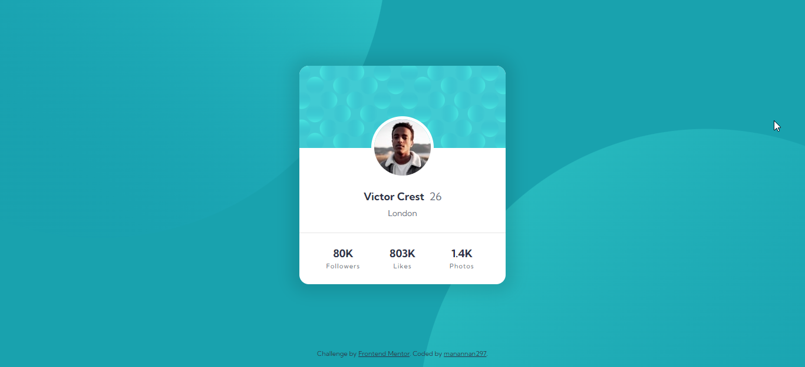

# Frontend Mentor - Profile card component solution

This is a solution to the [Profile card component challenge on Frontend Mentor](https://www.frontendmentor.io/challenges/profile-card-component-cfArpWshJ). Frontend Mentor challenges help you improve your coding skills by building realistic projects.

## Table of contents

- [Overview](#overview)
  - [The challenge](#the-challenge)
  - [Screenshot](#screenshot)
  - [Links](#links)
- [My process](#my-process)
  - [Built with](#built-with)
- [Author](#author)

## Overview

### The challenge

- Build out the project to the designs provided

### Screenshot

### Links

- Solution URL: [frontendmentor](https://www.frontendmentor.io/solutions/profile-card-component-gw-3lg0BOO)
- Live Site URL: [github](https://manannan297.github.io/fm-profile-card-component/)

## My process

### Built with

- Semantic HTML5 markup
- Mobile-first workflow
- SCSS
- Flexbox

## Author

- Frontend Mentor - [@Manannan297](https://www.frontendmentor.io/profile/Manannan297)
